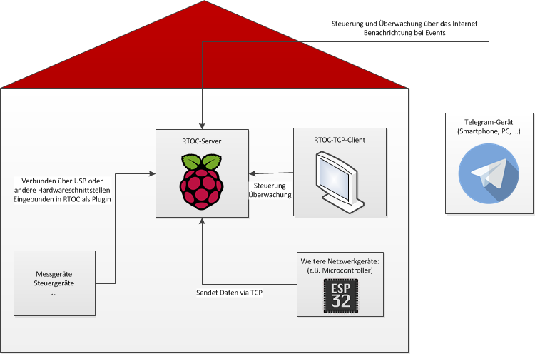
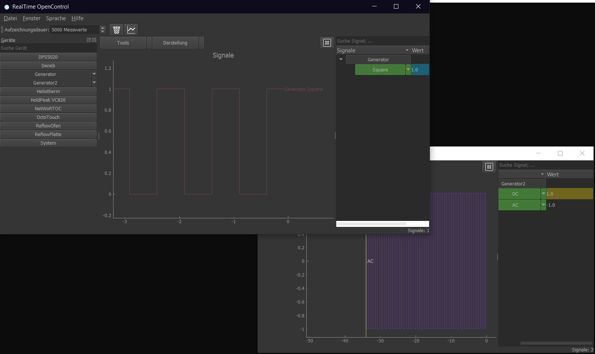
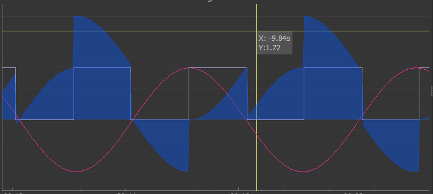
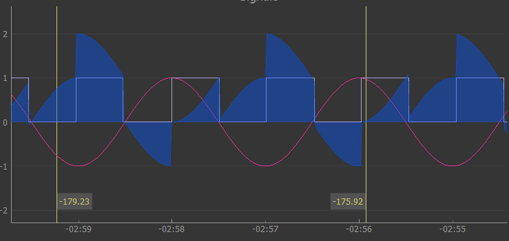
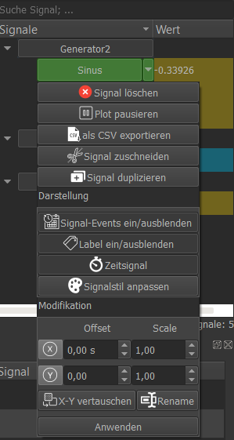
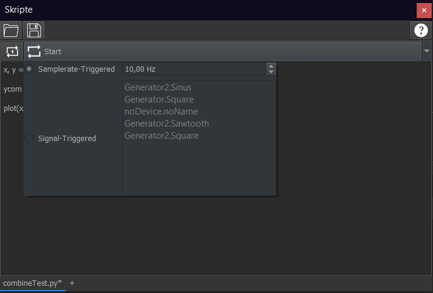

# RealTime OpenControl (RTOC)

### Version 1.8.2

[**This README is available in GERMAN here.**](misc/README_german.md)

[Documentation](https://git.kellerbase.de/haschtl/kellerlogger/wikis/RealTime-OpenControl-(RTOC))

RealTime OpenControl enables simple real-time data recording, visualization and editing. The recording can be done with a local Python scripts or via TCP locally/from the network. Visualization and editing is available locally, in the network (TCP and HTML) and via Telegram on the smartphone.

In addition to data recording, events can also be recorded. These can, for example, trigger a telegram message.

Possible applications:

- Central measurement data recording of laboratory instruments with PC connection (e.g. power supply unit, multimeter, sensors, microcontroller)
- Central recording of measurement data from Internet devices (e.g. mobile weather stations, drones, smartphones)
- Remote monitoring and control of processes and devices with PC and Smartphone (Telegram) (e.g. 3D printing, heating, Custom-SmartHome)
- Controlling between several devices (e.g.: power regulation of a power supply unit on the temperature sensor of a multimeter)
- Decentralized data recording (e.g. on Raspberry) and access via network connection (smart projects)


## Getting Started

RTOC is written in Python 3.  Tested on Windows and Linux.

Python 3 (and pip3) need to be installed on the System. But you can also download the Stand-Alone-Builts for Windows and Linux below.

### Installing with Python3 (recommended)

RTOC is available in the Python package manager PIP:

```
pip3 install RTOC
```

After installing you can run RTOC with

```
// local RTOC-instance including GUI
python3 -m RTOC
// local RTOC-instance without GUI (only TCP-Server, [HTTP-Server, Telegram-Bot])
python3 -m RTOC -s
// remote RTOC-instance with GUI
python3 -m RTOC -r <ADRESS>
```

After the first start RTOC creates a directory for user plugins, temporary user data and settings.

```
user@rtoc-server:~$ ls Documents/RTOC
config.json  // Settings for RTOC
devices/ 	 // Directory for user-plugins
plotStyles.json // Custom plotstyles for signals are stored in this file
```

### Installing with Builds (not tested well)

Download the latest release builds for Windows (soon also Linux) here.

Extract the .zip file into a directory. RTOC is started by double-clicking on "RTOC.exe". Alternatively via command line

```
// local RTOC-instance including GUI
./RTOC
// local RTOC-instance without GUI (only TCP-Server, [HTTP-Server, Telegram-Bot])
./RTOC -s
// remote RTOC-instance with GUI
./RTOC -r <ADRESS>
```

After the first start RTOC creates a directory for user plugins, temporary user data and settings.

```
user@rtoc-server:~$ ls Documents/RTOC
config.json  // Settings for RTOC
devices/ 	 // Directory for user-plugins
plotStyles.json // Custom plotstyles for signals are stored in this file
```

### Manuelle Installation

To use RTOC, the following dependencies must be installed

```python
pip3 install numpy pyqt5 pyqtgraph markdown2 xslxwriter scipy qtmodern
```

The following packages should also be installed

```
pip3 install python-telegram-bot matplotlib requests python-nmap bokeh pycryptdomex
```

The RTOC repository can then be cloned with

```shell
git clone git@git.kellerbase.de:haschtl/kellerlogger
```

Now RTOC can be started:

```shell
cd kellerlogger
// local RTOC-instance including GUI
python3 RTOC
// local RTOC-instance without GUI (only TCP-Server, [HTTP-Server, Telegram-Bot])
python3 RTOC -s
// remote RTOC-instance with GUI
python3 RTOC -r <ADRESS>
```

After the first start RTOC creates a directory for user plugins, temporary user data and settings.

```
user@rtoc-server:~$ ls Documents/RTOC
config.json  // Settings for RTOC
devices/ 	 // Directory for user-plugins
plotStyles.json // Custom plotstyles for signals are stored in this file
```


## First steps



### Wiki
[Read the Wiki for full documentation](https://git.kellerbase.de/haschtl/kellerlogger/wikis/RealTime-OpenControl-(RTOC))

### Default/Example Plugins:

- function generator: generates sine, square, sawtooth, random, AC, DC
- NetWoRTOC: Control and data exchange between several RTOC-servers

You can get more plugins from the [RTOC-plugin-repository](https://git.kellerbase.de/haschtl/rtoc-plugins):
- System: For recording many system variables (CPU, Memory, Network,...)
- Octoprint: Recording of 3D printers
- DPS5020: power supply unit recording and control (possibly also DPS5005, ...)
- HoldPeak VC820: Multimeter Measurement Recording (also other VC820)
- ...


### First GUI-Run

The graphical user interface of RTOC offers a wealth of functions for data display and processing.

- measuring tools
- Customize and save plot styles
- Save and load session
- Create multiple plots
- Run in the background
- Import and export data
- Scripts:
  - Multi-Tab Script Editor
  - The user can interact with the signals and plugins during runtime:
    - Execute plugin functions or set plugin parameters
    - Edit signals, create new signals, crop, overlay, ...
    - Scaling, shifting of signals
    - Run multiple scripts in parallel

[Complete GUI-tutorial here.](https://git.kellerbase.de/haschtl/kellerlogger/wikis/GUI)

### Write simple Python-Plugin

Python plugins are integrated into RTOC and can be used to

- send data as stream(=append) or plot(=replace) to RTOC
- send events

Plugins can **not** access all measurements. This can be done with a TCP connection to RTOC.

[Example-Plugins here.](https://git.kellerbase.de/haschtl/kellerlogger/wikis/PlugIns)

### Simple local TCP-Datastream

TCP clients can establish a connection to the RTOC server on the same computer or in the network (check firewall settings). With the necessary port shares on the router and dynamic DNS, the RTOC server can also be accessed from the Internet.

TCP communication takes place with JSONs, which allows communication in all programming languages and also, for example, with an ESP8266/ESP32 microcontroller. This connection can also be end-to-end-encrypted with AES.

The client can

- send data as stream(=append) or plot(=replace) to RTOC
- send events
- access all measurement data and events of the RTOC-server
- access all RTOC-server functions
- access all RTOC-server plugin functions and parameters

The connection between RTOC server and client can be encrypted end-to-end (DES) with a password (min. 8 characters).

[Example for TCP here.](https://git.kellerbase.de/haschtl/kellerlogger/wikis/clientCommunication)

### Include Telegram-messanger

[Tutorial for Telegram here.](https://git.kellerbase.de/haschtl/kellerlogger/wikis/telegram)

## Screenshots

#### MultiWindow



#### Crosshair-tool



#### Cutting-tool



#### Rectangle-measure-tool


#### Plotstyle-window


#### Plot-View-Dropdown


#### Signal



#### Plot


#### Scripts



## Built With

* [cx_freeze](https://anthony-tuininga.github.io/cx_Freeze/)

## External libraries and scripts

- [Jsonsocket from mdebbar](https://github.com/mdebbar/jsonsocket)
- [Taurus PyQtGraph](https://github.com/taurus-org/taurus_pyqtgraph.git)
- [ImportCode script from avtivestate.com](http://code.activestate.com/recipes/82234-importing-a-dynamically-generated-module/)
- [VC820Py from adnidor (for HoldPeak_VC820 plugin)](https://github.com/adnidor/vc820py)

All icons used in this software (including plugins) are kindly provided by [Icons8](www.icons8.com)

## Contributing

Please read [CONTRIBUTING.md](https://gist.github.com/PurpleBooth/b24679402957c63ec426) for details on our code of conduct, and the process for submitting pull requests to us.

## License

This project is licensed under the  **GNU General Public License v3.0** - see the [LICENSE](LICENSE) file for details
