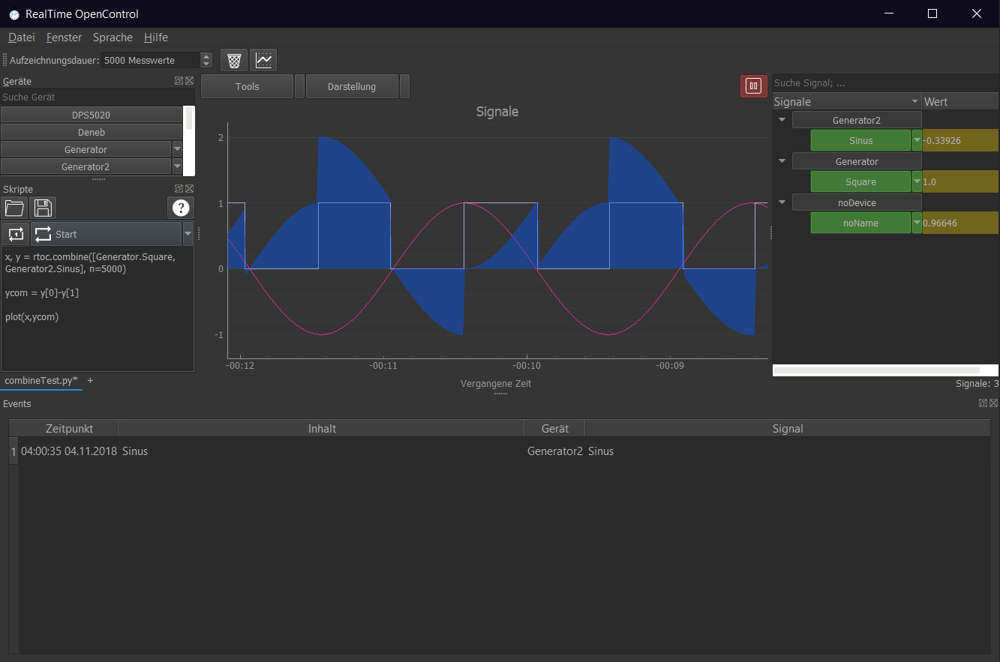
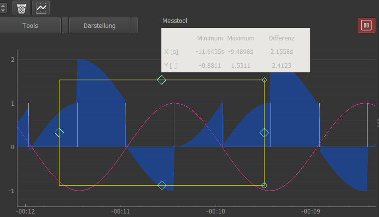
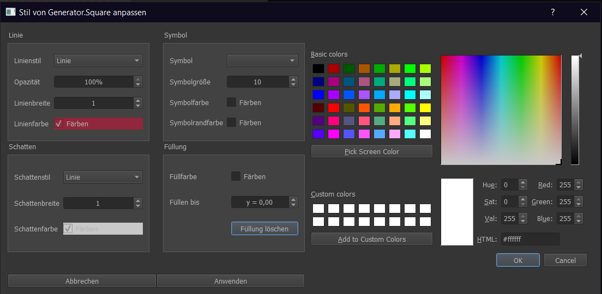
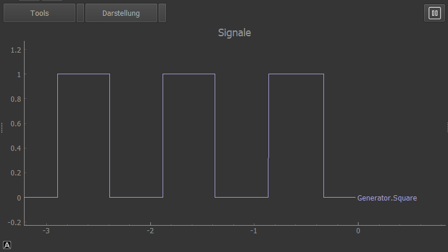

# RealTime OpenControl (RTOC)
### Version: 1.6

### Currently this README and the WIKI-documentation is only available in german. The software is available in english AND german, selectable in the menu. English translations for the documentation is following soon!

Short description: RealTime OpenControl is a universal measurement, plot and control-software. It's purpose is to put measurements from different devices (for example 3d-printers, multimeters, power supplies, microcontroller,...) into one tool. Its fully expandable for every device with Python-Plugins and a running TCP-server. You can also control the devices (if your plugin has this functionality) with python-scripts, which you can write and run at runtime! This makes it also possible to plot everything else. There are some example-plugins and example-scripts included. It also offers an extended plotting-GUI with multiple plots, measure-tools, style-adjustments.
Just have a look at the screenshots and the wiki, download it, try it, and send me suggestions and bug-reports, if you find some! 
Note: the english-translation is not perfect, some text isn't translated. This will be fixed sooner or later, depending on the feedback.

### Usecases:
- Home-automation
- temperature-sensor calibration
- system-monitor
- long-time-measurements
- just playing around with plots

You can download the python3-sourcecode and run it with `python3 RTOC.py` or you can download the build from here and run it without python!

RTOC starten:
> python3 RTOC.py
> Alternativ wird hier ein BUILD bereitgestellt (inklusive Installer)

RealTime OpenControl ermöglicht eine geräteübergreifende Messaufzeichnung.
Außerdem kann man mit dem integrierten Python-Skript-Editor auf die Messdaten und Geräte zugreifen und mit diesen interagieren. Somit lassen sich langsame Regelungen zwischen mehreren Geräten realisieren.
Z.B.: Temperaturmessung mit Multimeter (mit USB-Anschluss) und Regelung eines Heizelements auf eine Solltemperatur. Ideal zum Aufzeichnen, Testen und Optimieren von Regelungen. Eignet sich auch für Custom-HomeAutomation (z.B.: auf Raspberry Pi oder HomeServer) mit maximaler Flexibilität und Anpassbarkeit

Die Einbindung neuer Geräte ist einfach möglich:
- Als Python-Plugin für RTOC (v.a. für lokale Geräte)
- Als TCP-Client (v.a. für Netzwerkgeräte)
(für weitere Infos siehe Wiki)

### Standart/Beispiel Plugins:
- Funktionsgenerator: Erzeugt Sinus, Square, Sawtooth, Random, AC, DC
- System: Zur Aufzeichnung vieler Systemvariablen (CPU, Memory, Network,...)
- Octoprint: Aufzeichnung für 3D-Drucker
- DPS5020: Netzgerät-Aufzeichnung und Steuerung (evtl. auch DPS5005, ...)
- HoldPeak VC820: Multimeter Messaufzeichnung (wahrsch. auch andere VC820)
- NetWoRTOC: Datenaustausch zwischen mehreren RTOC's im Netzwerk

Die Oberfläche hat erweiterte Darstellungsoptionen und verschiedene Messtools für den Plot bereit.

## Funktionsübersicht
- Plugins und TCP-Clients:
  - können Daten als Stream(=append) oder Plot(=replace) senden
  - können Events senden
- Skripte:
  - Multi-Tab Skript-Editor
  - Der Nutzer kann während der Laufzeit mit den Signalen und Plugins interagieren:
    - Pluginfunktionen ausführen oder Pluginparameter setzen
    - Signale bearbeiten, neue Signale erzeugen, zuschneiden, überlagern, ...
    - Skalieren, verschieben von Signalen
  - Mehrere Skripte parallel laufen lassen
- Messwerkzeuge
- Plotstile anpassen und speichern
- Session speichern und laden
- Mehrere Plots erzeugen
- Im Hintergrund laufen
- Daten importieren und exportieren

## [Alles weitere steht im Wiki](https://git.kellerbase.de/haschtl/kellerlogger/wikis/RealTime-OpenControl-(RTOC))
### Screenshots - siehe unten

## Python3 Paket-Abhängigkeiten
- sudo apt install python3-pyqt5
- sudo apt install python3-pyqt5.qtsvg
- sudo apt install python3-pip
- pip3 install numpy
- pip3 install pyqtgraph
- pip3 install markdown2
- pip3 install xlsxwriter
- pip3 install scipy
- pip3 install qtmodern

Optional für Plugins:
- pip3 install minimalmodbus (DPS5020)

## Externe Bibliotheken und Skripte
- [Jsonsocket von mdebbar](https://github.com/mdebbar/jsonsocket)
- [Taurus PyQtGraph](https://github.com/taurus-org/taurus_pyqtgraph.git)
- [ImportCode Script von avtivestate.com](http://code.activestate.com/recipes/82234-importing-a-dynamically-generated-module/)
- [VC820Py von adnidor (für das HoldPeak_VC820 Plugin)](https://github.com/adnidor/vc820py)

Alle Icons, die in dieser Software (inklusive Plugins) benutzt werden, werden freundlicherweise zur Verfügung gestellt von [Icons8](www.icons8.com)

## Beispiel TCP Client für Pythonista (iOS)

## MultiWindow

## Crosshair-Tool

## Cutting-Tool

## Rechteck-Messtool

## Plotstile anpassen

## Plot-Tools-DropDown

## Plot-Ansicht-Dropdown

## Signal

## Plot

## Scripte

